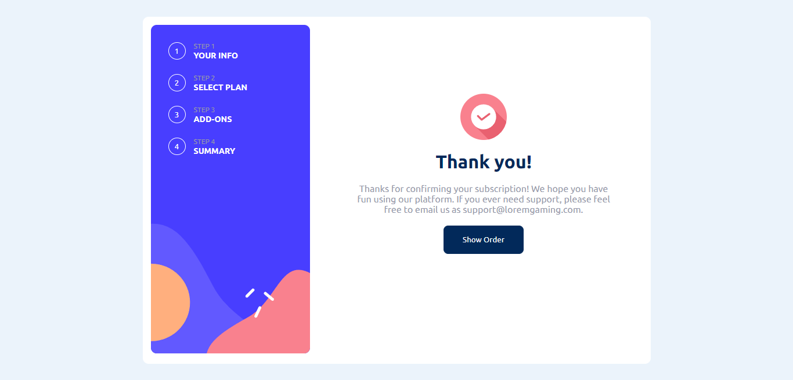

# Frontend Mentor - Multi-step form solution

This is a solution to the [Multi-step form challenge on Frontend Mentor](https://www.frontendmentor.io/challenges/multistep-form-YVAnSdqQBJ). Frontend Mentor challenges help you improve your coding skills by building realistic projects.

## Table of contents

- [Overview](#overview)
  - [The challenge](#the-challenge)
  - [Screenshot](#screenshot)
  - [Links](#links)
- [My process](#my-process)
  - [Built with](#built-with)
  - [What I learned](#what-i-learned)
- [Author](#author)

## Overview

### The challenge

Users should be able to:

- Complete each step of the sequence
- Go back to a previous step to update their selections
- See a summary of their selections on the final step and confirm their order
- View the optimal layout for the interface depending on their device's screen size
- See hover and focus states for all interactive elements on the page
- Receive form validation messages if:
  - A field has been missed
  - The email address is not formatted correctly
  - A step is submitted, but no selection has been made

### Screenshot

#### Desktop

### Links

- Solution URL: [Solution URL](https://www.frontendmentor.io/solutions/responsive-multi-step-form-with-react-typescript-using-context-api-siKdR8RJAz)
- Live Site URL: [Live Site](https://multi-step-form-frontendmentor-three.vercel.app/)

## My process

### Built with

- HTML
- CSS
- JavaScript
- React
- CSS Module
- TypeScript

### React Hooks

- useState
- createContext
- useContext

### What I learned

- Portuguese Version:
  Este projeto me ajudou a praticar os meus conhecimentos em typescript, controle de estados, CSS condicional e context API.

- English Version:
  This project helped me to practice my knowledge in typescript, state control, conditional CSS and context API.

## Author

- Linkedin - [Linkedin João Victor Mendes Silva](https://www.linkedin.com/in/joaovictormendessilva/)
- Frontend Mentor - [@joaovictormendessilva](https://www.frontendmentor.io/profile/joaovictormendessilva)
